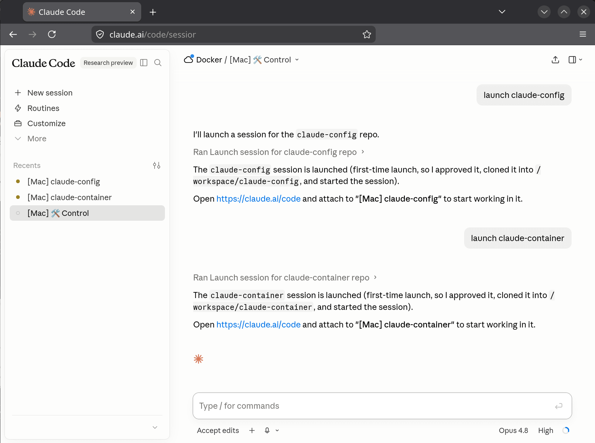

# claude-container

Run Claude Code in a **single, sandboxed Docker container** that you drive from
[claude.ai/code](https://claude.ai/code) - on your laptop or your phone. The agent has
full bash and edits files freely, but only inside the container, never your real machine.

Out of the box it's a plain sandbox. Point it at a **Forgejo** server (optional) and it
gains a `forgejo` CLI plus one-command "launch a repo from my org" sessions. Nothing about
your setup is baked into the image - it's all runtime config.



*The container's session in claude.ai/code - drive it from any browser or the phone app.*

## Quick start

You need Docker (e.g. [OrbStack](https://orbstack.dev) on macOS) and a Claude **Pro/Max**
account.

1. Set up the container

```sh
# Grab the compose file (and the env template if you want to configure anything)
curl -O https://raw.githubusercontent.com/alangrainger/claude-container/main/compose.yaml
curl -O https://raw.githubusercontent.com/alangrainger/claude-container/main/.env.example

cp .env.example .env             # optional: edit to add a forge, dotfiles, labels
docker compose up -d             # pull the published image and start the container
```

2. Run the initial setup.

```sh
docker compose exec claude first-setup.sh
```

3. After you have successfully authenticated, type **`/exit`**

4. Restart the container and the **🛠️ Control** session should appear in https://claude.ai/code

That's it. From now on the container reconnects on its own across restarts, image
rebuilds, and host reboots - you won't log in again.

## Configuration

Everything is optional. Copy `.env.example` to `.env` and uncomment what you want; with
nothing set you get a plain Claude sandbox. `.env` is gitignored - keep your token there.

| Variable                                           | What it does                                                                                    |
|----------------------------------------------------|-------------------------------------------------------------------------------------------------|
| `FORGE_HOST`, `FORGE_ORG`, `FORGE_TOKEN`           | Turn on the baked `forgejo` CLI (issues + commits) and auto-cloning repos by name from your org |
| `WEB_NAME_PREFIX`                                  | Label your sessions in claude.ai/code, e.g. `[Laptop]`                                          |
| `SETUP_REPO`                                       | Clone and run your own setup repo at first-setup (dotfiles, agent-memory)                       |
| `GIT_BASE`, `GIT_USER`, `GIT_TOKEN`                | Auto-clone from any git host (defaults to your Forgejo org)                                     |
| `FORGE_WORKDIR`                                    | Where forge-org repos launch; defaults to `WORKDIR`                                             |
| `WORKDIR`, `PERMISSION_MODE`, `CONTAINER_HOSTNAME` | Where sessions run, claude's permission mode, the name shown as the session origin              |

See [`.env.example`](.env.example) for the full list with examples.

## Using it

The container runs one always-on **control session** (shown as "🛠️ Control" in
claude.ai/code). Open it from any device and ask, in plain English, to *"launch `<repo>`"*
- it starts a fresh Claude session in `/workspace/<repo>` (forge-org repos may launch in
`FORGE_WORKDIR` instead), cloning the repo from your forge if it isn't there yet.

To stop a session, **Delete or Archive it** in claude.ai/code - the container cleans up.

## How it works

- **One container, many sessions.** Each session is a `tmux` session running
  `claude remote-control`; the control session is always up so you can start the others.
- **Hardened.** Non-root user, dropped Linux capabilities, read-only root filesystem. The
  only writable places are the `~/.claude` and `/workspace` volumes.
- **Persistent.** Your login and state live in a small `~/.claude` volume (claude is told
  via `CLAUDE_CONFIG_DIR` to keep its config there too), so rebuilds and reboots don't log
  you out. No bloat - just `~/.claude`, not your whole home directory.

## What's inside

| File                        | Role                                                            |
|-----------------------------|-----------------------------------------------------------------|
| `Dockerfile`                | Alpine + Node + claude-code + tmux/git/ripgrep/python, non-root |
| `compose.yaml`              | The service, volumes, hardening, and `.env` loading             |
| `.env.example`              | Template for your gitignored `.env`                             |
| `scripts/first-setup.sh`    | One-time login + optional setup-repo hook                       |
| `bin/launch_session.sh`     | Starts (and clones) a session for a repo                        |
| `bin/forgejo`               | The Forgejo API wrapper                                         |
| `.github/workflows/ci.yaml` | Builds + publishes the image to GHCR on a version tag           |

## Build from source

The published image covers the normal case. To build it yourself instead, clone this
repo, uncomment `build: .` (and comment out `image:`) in `compose.yaml`, then:

```sh
docker compose up -d --build
```
